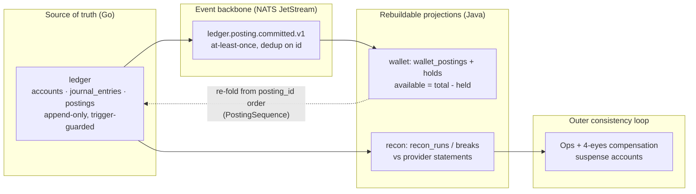

# SharkPay — Backend Design (Principal Engineering Document)

| | |
|---|---|
| **Status** | Canonical — authored by the Principal Backend Engineer (Task 15) |
| **Owner** | @Roy-Wanyoike |
| **Applies to** | Every backend change in this repository, all 10 services, both runtimes |
| **Companions** | [ADR 001 — stack lock](adr/001-stack-lock.md) · [ADR 002 — backend strategy](adr/002-backend-strategy.md) · [ADR 003 — safe parallelism & verification](../.agent-logs/reference/adr-003.md) · [ARCHITECTURE](ARCHITECTURE.md) · [DATA-MODEL](DATA-MODEL.md) · [STATE-MACHINES](STATE-MACHINES.md) · [SECURITY](SECURITY.md) · [OBSERVABILITY](OBSERVABILITY.md) · [RUNBOOKS](RUNBOOKS.md) |

This document describes the backend **as it is actually built in this repo** —
`services/ledger` (Go, merged PR #1), `services/providers` (Go, merged PR #1),
`services/{identity,wallet,fx,risk}` (Java 25 / Spring Boot 4.1.1, Wave 2),
`packages/go/money` and its 1:1 Java port `packages/java/sharkpay-money` — plus
the binding design for the remaining services (`payments`, `payouts`,
`api-gateway`, `reconciliation`) that ship in later phases. Where something is
planned rather than built, this document says so explicitly. Every table,
endpoint, topic, file and gate named below exists in the tree.

---

## 1. Executive summary — what "best" means for a modern fintech

"Best backend" is not "most features per sprint". For a money platform the
ordering of virtues is fixed and non-negotiable:

1. **Correctness > availability > latency.** A payment platform that is fast
   but wrong is a lawsuit; one that is correct but briefly unavailable is an
   incident. Concretely: the double-entry ledger
   (`services/ledger`, tables `journal_entries` / `postings`) is append-only
   with DB-enforced balance invariants (`trg_entry_balanced`,
   `trg_wallet_non_negative` in `migrations/001_ledger_init.sql`), so a
   correctness bug **cannot** silently corrupt money — it can only produce a
   rejected transaction, which is observable and fixable. We spend latency
   budget (SLOs in [OBSERVABILITY.md §8](OBSERVABILITY.md)) only after
   invariants are structurally guaranteed.
2. **Observability is first-class, not an afterthought.** The OTel
   collector → Prometheus/Loki/Tempo stack, the canonical metric names, the
   23 alert rules and the SLO/burn-rate math are *shipped code* under
   `infrastructure/observability/` (Task 13), and every alert's runbook lives
   in [RUNBOOKS.md](RUNBOOKS.md). A money path you cannot see is a money path
   you cannot operate.
3. **The delivery protocol is architecture.** SharkPay is built by 30+
   parallel autonomous agents. ADR 003 makes that safe *structurally*:
   one agent = one module = one directory, integrator-owned git, append-only
   contracts, and a G1–G5 verification ladder that must be green before any PR
   exists. "Everything works and it's tested and verified before a PR is
   created" is enforced by `scripts/verify-all.sh` and CI
   (`.github/workflows/verify.yml`), not by hope.
4. **Fail closed on money, open on features** (PRD §5). Ambiguous provider
   outcomes park funds in `PROCESSING` and page a human
   ([SECURITY.md §4](SECURITY.md)); a broken webhook endpoint degrades to
   retries without ever blocking the ledger.

The architectural bet, in one sentence: **one authoritative Go ledger, event
streams on NATS JetStream, Java platform services that own everything
non-money, Temporal for orchestration, and Postgres as the only durable state
— with every derived datum rebuildable from the ledger.**

## 2. Domain decomposition & data ownership

Ten services, one schema each, zero shared tables. Cross-service reads happen
only through the owning service's API or a published event (ARCHITECTURE.md §1
hard rule 1). Runtime split is locked by [ADR 002](adr/002-backend-strategy.md):
Go owns the money-critical hot path (ledger, provider gateway), Java 25 owns
the platform build-out (identity, wallet, fx, risk, and later payments,
payouts, api-gateway, reconciliation).

| Service | Aggregate(s) it owns | Runtime | Storage (schema, migration tool) | Downstream consumers | Propagation event(s) |
|---|---|---|---|---|---|
| `ledger` | `Account`, `JournalEntry` (+ `Posting` legs) | Go | `accounts`, `journal_entries`, `postings` (golang-migrate, `001_ledger_init.sql`) | wallet (balance projection), reconciliation (break detection), api-gateway (fan-out) | `ledger.posting.committed.v1` |
| `providers` | `Provider`, `AdapterCall`, breaker health | Go | `providers`, `adapter_calls`, `provider_credentials` (vault ref only) | payments, payouts (transfer status); recon (provider statements) | `providers.transfer.*.v1` |
| `identity` | `Principal`, `SharkId`, `KycRecord`, `Device` | Java | `principals`, `shark_ids`, `kyc_records`, `devices` (Flyway V1; JPA entities in `storage/`) | wallet (principal status), risk (KYC tier), payments/payouts (capability gating) | `identity.principal.created.v1`, `identity.kyc.tier.changed.v1` |
| `wallet` | `Wallet`, `Hold`, balance `Projection` | Java | `wallets` (UNIQUE `principal_id,currency`), `holds`, `wallet_postings`, `applied_ledger_events`, `idempotency_keys` (Flyway V1) | payments/payouts (hold/release/capture), console statements | `wallet.balance.changed.v1`, `wallet.holds.v1`, `wallet.state.v1` |
| `fx` | `Quote`, `Conversion`, `Rate` | Java | `quotes`, `conversions` (Flyway V1) | payments (cross-currency V2), ledger (4-leg conversion entry via `LedgerPort`) | `fx.quote.locked.v1`, `fx.conversion.executed.v1` |
| `risk` | `RuleSet`, `Evaluation`, `Case`, `VelocityCounter` | Java | `rule_sets`, `evaluations`, `cases`, `velocity_counters` (Flyway V1) | payments/payouts (pre/post gates) | `risk.decision.v1`, `risk.case.opened.v1`, `risk.case.resolved.v1` |
| `payments` *(phase 5)* | `PaymentIntent` | Java + Temporal | `payment_intents` (UNIQUE `principal_id,client_key`), `payment_state_transitions`, `fees` | wallet, risk, webhooks | `payments.payment.{created,pending_provider,succeeded,failed,expired,reversed}.v1` |
| `payouts` *(phase 6)* | `Payout`, `Batch` | Java + Temporal | `payouts`, `payout_state_transitions`, `batches` | wallet, risk, webhooks | `payouts.payout.*.v1`, `transfers.transfer.succeeded.v1` |
| `api-gateway` *(phase 9)* | `ApiKey`, `WebhookEndpoint`, `WebhookDelivery` | Java | `api_keys` (hashed, scoped), `webhook_endpoints`, `webhook_deliveries`, `request_logs` | merchants (public `/v1` + HMAC webhooks) | `platform.webhook.*.v1` |
| `reconciliation` *(phase 10)* | `ReconRun`, `Break`, `ProviderStatement` | Java | `recon_runs`, `breaks`, `provider_statements`, `settlement_reports` | ops console, finance | `recon.break.detected.v1` |

Ownership rules that make this decomposition real:

- **Only `ledger` writes `journal_entries`/`postings`**; every other service
  requests postings through the ledger's internal idempotent API
  (`POST /internal/transactions`, `POST /internal/transactions/{id}/reverse`,
  `GET /internal/accounts/{id}/statement` — `services/ledger/internal/api/server.go`).
- **Only `providers` talks to external rails** (ARCHITECTURE.md §1 rule 3); no
  domain service imports a provider SDK. The HoneyCoin adapter
  (`services/providers/internal/honeycoin/adapter.go`) is the reference
  implementation every future adapter copies, gated by the conformance suite
  in `tests/providers/`.
- **Schemas are physically separated** in one Postgres 18 instance per
  environment via `infrastructure/dev/postgres/init/01-schemas.sql` with
  per-service credentials; Go services migrate with golang-migrate, Java with
  Flyway — no schema ever has two migration pipelines (ADR 002 §2).
- **Temporal namespaces are per-runtime**: a workflow is registered and
  continued by exactly one implementation (ADR 002 §2), so no cross-language
  workflow handoff ever exists.
- **Events are the only cross-runtime seam.** Every event is a versioned
  CloudEvents 1.0 envelope registered in `contracts/events/events.md` with a
  JSON Schema (draft 2020-12) in `contracts/events/`; consumers dedupe on
  `id` and treat `data.state` as monotonic.

## 3. The money model — one representation, two runtimes, zero floats

**The ledger is the single source of truth for money.** Wallet balances,
console statements, and merchant reports are projections (§4). Everything
downstream of `ledger.posting.committed.v1` is rebuildable; nothing upstream
of it is derivable.

### 3.1 Integer minor units end-to-end

Money is `long`/`int64` minor units + a 3-letter currency code, from the
HTTP edge to the database:

| Layer | Representation | Enforced by |
|---|---|---|
| Public API (`/v1`) | `{ "amount_minor": 150000, "currency": "KES", "exponent": 2 }` | `contracts/openapi/v1/common.yaml` (OpenAPI 3.1) |
| Events | integer minor units + currency, never floats | `contracts/events/*.json` (JSON Schema) + events.md rule 4 |
| Go code | `packages/go/money`: `Money{AmountMinor int64, Currency, Exponent}`, construction always validated | unit tests incl. `money_test.go`, `currency_test.go` |
| Java code | `packages/java/sharkpay-money` (`com.sharkpay:sharkpay-money:1.0.0`): 1:1 port — validated construction, explicit `MoneyOverflowException`, `CurrencyMismatchException`, no-float parsing | G2 money-safety tests in every service |
| Database | `BIGINT` (`postings.debit`, `postings.credit`, `holds.amount_minor`, …) + `CHAR(3)` currency | `migrations/001_ledger_init.sql`, DATA-MODEL.md §1 |

`BigDecimal` appears **only** at display edges (per ADR 001 note 4), and the
wallet's `PostingSequence.auditTotal()` uses `BigInteger` explicitly as an
*audit* cross-check "never used in money paths" — the operating path is pure
`long` math with checked overflow (`Math.addExact` / `Math.subtractExact`).

### 3.2 Cross-runtime parity by construction

`packages/java/sharkpay-money` is a **1:1 port of `packages/go/money`**, not
an independent implementation. This is the only acceptable answer to
polyglot money: two libraries that each pass their own tests do not prove
they *agree with each other*. The port is pre-staged into the local Maven
repository before any Java workstream dispatches (ADR 003 §1), so every
Java service compiles against the identical semantics from its first
commit. Parity is re-proven at G5 when the integrator rebuilds the full
cross-runtime matrix, and CI
(`.github/workflows/verify.yml`) runs `clean install` on `packages/` first
precisely so every service builds against the published artifact.

### 3.3 Largest-remainder allocation (deterministic splits)

Fee distribution, split payments, and FX markup must divide an amount
*exactly*. `Money.Allocate(ratios, total)`
(`packages/go/money/allocate.go`) implements the largest-remainder method
with 128-bit intermediate math (`bits.Mul64` / `bits.Div64`):

- parts always sum to the original amount — no minor unit is lost or
  created;
- each part is within one minor unit of its exact proportional share;
- ties are broken by lower index, so the result is **deterministic across
  runtimes and runs** (a requirement for reconciling splits against
  provider statements);
- invalid inputs (`ratios` not summing to `total`, negative ratios) return
  `ErrInvalidRatios` — nothing is ever partially allocated.

### 3.4 Float prohibition is a build gate, not a style rule

ADR 001 note 4 forbids floating-point money; ADR 003 G2 turns it into a
**checkable gate**: the money-safety test taxonomy includes a *no-float
audit* — a grep for `double`/`float` in money paths must come back empty,
enforced alongside `mvn clean verify` / `go test` and repeated by the PR
template checklist (`.github/PULL_REQUEST_TEMPLATE.md`). A PR that
introduces a float in a money path cannot claim G2 green.

### 3.5 Currency exponent discipline

`Currency.Exponent()` (`services/ledger/internal/domain/money.go`):
KES/USD/EUR/GBP → 2; USDC/USDT → 6 (token-standard minor units). The
exponent is **display-only metadata** — it travels in wire payloads and is
used for formatting, never in arithmetic, never in comparisons. Mixing
currencies is rejected structurally: wallet `Balances` requires one
currency across partitions; `PostingSequence.apply` throws
`ProjectionInconsistencyException` on a leg whose currency differs from the
wallet's; ledger entries must balance per currency per entry (invariant #1).
The V1 currency set is closed (`KES USD EUR GBP USDC USDT`) and validated
at parse time — no free-form currency strings anywhere.

## 4. Consistency architecture — truth, projections, and the outer loop

**Ledger = truth. Wallet = a projection that can be re-folded at any time.**
The wallet service applies `ledger.posting.committed.v1` legs through
`PostingSequence` (`services/wallet/.../domain/PostingSequence.java`), which
keys legs by the ledger's globally monotonic `posting_id` and **re-folds the
whole running balance in posting order on every insert**. Out-of-order event
delivery converges to exactly the same projection as in-order delivery; a
duplicate `posting_id` is a no-op; a leg that would drive the wallet below
zero is rejected (`ProjectionInconsistencyException`) because the ledger
guarantees wallet accounts never go negative — a violation means an upstream
contract breach and lands in RB-4, not in a silent balance.

**Event-carried state transfer.** CloudEvents envelopes carry complete
business state (not just "something changed"), so consumers never need a
synchronous call back to the producer to do their work. The wallet computes
`available = total - held` locally; risk scores from the event payload; the
api-gateway delivers webhooks from the event body. This is what lets us
tolerate producer downtime without cascading reads.

**Why CRDTs are rejected.** A CRDT guarantees *convergence*, not
*agreement on the exact ledger value at a specific commit*. Money requires
the latter: `SUM(debits) = SUM(credits)` per entry, per currency, enforced at
a serialization point. CRDTs permit interim divergent states that later
merge — in a ledger that is indistinguishable from a reconciliation break,
and the merge rules themselves become unauditable money logic. Instead we use
a single-writer-per-account discipline (row locks, §8) with a deterministic
total order (`posting_id`), which gives *linearizable* money and
*eventually-consistent, exactly-rebuildable* views. The complexity we accept
is the projection lag bound — which is an SLO (≤ 5 s), not a correctness risk.

**Read-model lag bounds.** `sharkpay_wallet_projection_lag_seconds` (gauge
per topic) → `WalletProjectionLag` alert at > 5 s for 5 m. Reads that cannot
tolerate lag (risk evaluation gates, payout pre-checks) read the wallet
service's current projection *and* the orchestration double-checks at
capture time — the ledger remains the arbiter.

**Reconciliation is the outer consistency loop.** STATE-MACHINES.md §7.4:
for any intent, `hold/release/capture/reversal` ledger entries exist iff the
corresponding transitions occurred; the reconciliation service re-validates
this pairing daily against provider statements (`ReconcilePositionsUseCase`
already exists in `services/fx`; the dedicated `reconciliation` service lands
in phase 10). Breaks age in buckets and escalate per RB-7; the resolution is
always a new compensation entry into `suspense:*` accounts — never an edit.

## 5. Idempotency — three enforced layers

Retries are the *normal* case in a distributed system (client timeouts,
JetStream redelivery, Temporal activity retries). Every money operation is
protected at three independent layers; any one of them alone is sufficient to
prevent a double effect, and together they make retry storms boring.

| Layer | Mechanism | Where it lives |
|---|---|---|
| **(a) API edge** | `Idempotency-Key` header required on all state-changing POSTs; scope `(api key, endpoint, key)`; replay returns the **original response** with `X-Idempotent-Replay: true`; same key + different payload ⇒ `409 idempotency_conflict` | api-gateway (public `/v1`), wallet internal controllers (`InternalWalletController`, `InternalHoldController`), identity use-cases (`IdempotentRequest` + `RequestFingerprint`) |
| **(b) Event/outbox dedup** | producers emit exactly-once-per-commit (ledger: idempotent replay of the posting API does **not** re-emit `ledger.posting.committed.v1`); consumers dedupe — wallet logs applied event ids in `applied_ledger_events` and skips known `event.id`; `PostingSequence` no-ops on known `posting_id` | `contracts/events/events.md` rules 3 & envelope `id`; wallet `ApplyLedgerEventUseCase` |
| **(c) Storage constraints** | unique indexes and CHECKs that make duplicates *physically impossible* even if both upper layers fail | `journal_entries UNIQUE (source, transaction_key)`; partial unique `UNIQUE (reverses_entry_id)` (double-reversal guard); `wallet_postings PK (wallet_id, posting_id)` + `CHECK (balance_after >= 0)`; `wallets UNIQUE (principal_id, currency)`; `idempotency_keys PK (scope, key)`; `payment_intents UNIQUE (principal_id, client_key)` |

**Operation → layers protecting it:**

| Operation | (a) API key | (b) Event dedup | (c) Storage constraint |
|---|---|---|---|
| Create payment intent | `Idempotency-Key` at gateway | `payments.payment.created.v1` `id` | `UNIQUE (principal_id, client_key)` |
| Place / release / capture hold | scoped key per operation (`Scope.PLACE_HOLD` etc.) | `wallet.holds.v1` `id` | `idempotency_keys PK(scope,key)`; holds terminal-state CHECK |
| Ledger post | transaction key `source:ref[:subtype]` validated in `ValidateTransactionKey` | emitted once per committed entry | `UNIQUE (source, transaction_key)` |
| Reverse an entry | deterministic key `ops:rev:<entry id>` — retry replays the same reversal | `payments.payment.reversed.v1` emitted once | partial `UNIQUE (reverses_entry_id)`; domain rejects reversal-of-reversal (`CodeReversalOfReversal`) |
| Provider initiate | adapter-level key derived from our transaction key chain (ARCHITECTURE §4.3) | `providers.transfer.*.v1` `id` | `adapter_calls` audit rows |
| Webhook delivery | — | dedupe on `event.id` + HMAC timestamp replay cache (10 min) | `webhook_deliveries` attempt rows |

The key-chain discipline ([SECURITY.md §4](SECURITY.md)): every layer derives
its key from the original request key, so retries at *any* altitude collapse
onto the *same* durable key — the ledger's `transaction_key` format
(`payments:019283…:capture`) even embeds the source so a replay with a
different source cannot address the original key
(`ValidateTransaction` → `CodeTransactionKeySourceMismatch`).

## 6. Reliability patterns — at-least-once everywhere, effectively-once effects

**Transactional Outbox + NATS JetStream.** No service writes to the broker
inside its own request path. The pattern: the business row(s) and the
outbox row commit in the *same* Postgres transaction; a relay publishes to
JetStream afterwards. JetStream is configured with stream persistence and
per-event-type subjects (`ledger.posting.committed.v1` etc.); delivery is
**at-least-once**, and consumer-side dedup (§5b) converts that to
**effectively-once effects**. This is why we accept duplicate events as a
first-class input rather than fighting for exactly-once transport — the
latter does not exist, and pretending it does is how money disappears.
Today the wallet's ledger feed is bootstrap-fed through
`LedgerEventsController` (`POST /internal/ledger-events`, kept deliberately
as the `LedgerEventConsumer` port implementation until the NATS binding
lands with the integrator); the contract is identical, so the swap is a
transport change, not a semantic one. `docker-compose.yml` already runs
NATS 2.11 with JetStream and a `nats-box` profile tool for exactly this.

**Circuit breakers.** The Go provider gateway implements breaker semantics
in `services/providers/internal/health/breaker.go`: **5 failures within a
30 s rolling window → OPEN for 60 s → half-open probe**; a success closes
and forgets. The breaker state is the router's hard filter (ARCHITECTURE §4.1)
and its source of truth for monitoring is `sharkpay_providers_breaker_state`
(the Resilience4j breaker metrics in Java services are welcome but secondary
— OBSERVABILITY §5.1). Breaker state feeds `ProviderCircuitBreakerOpen`
(warning, ≥ 2 m) so a flapping rail becomes a ticket before it becomes an
incident.

**Timeout / backoff-with-jitter budgets.** Every hop has a budget, and the
sum of inner budgets must fit the outer SLO: adapter call timeout <
provider-router decision budget < payment hand-off budget (NFR-01: intent →
provider hand-off p99 ≤ 2 s) < API p99 ≤ 500 ms. Retries are bounded and
jittered to avoid synchronized retry waves, and the one iron rule from
[SECURITY.md §4](SECURITY.md): **ambiguous provider debits are never
auto-retried** — the payment parks in `PROCESSING` with an ops alert,
because retrying an ambiguous debit is the classic double-pay bug.

**Bulkheads.** Per-provider call budgets are isolated (one slow rail cannot
consume all egress workers); Java services carry Resilience4j bulkheads per
ADR 001 note 5; Kubernetes PDBs (`minAvailable` 2 in prod) plus HPA keep
capacity islands per service so a wallet incident cannot starve the ledger
of pods. The NetworkPolicies in `infrastructure/k8s/base/network-policies/`
are the network-level bulkhead: default-deny with allow-lists per dependency.

**Poison-message DLQ policy.** A message that repeatedly fails application
processing (not transport) is parked on a DLQ subject after
`max_deliver` attempts rather than blocking the consumer's position.
Wallet apply-failures are counted per `result` label
(`sharkpay_wallet_ledger_events_applied_total{result=error}`); anything in
the DLQ is drained deliberately per RB-3 — a human decides whether it is a
contract violation (fix producer, replay), a bug (fix consumer, replay), or
corrupt (quarantine + incident). We never auto-drop money-adjacent events.

## 7. Orchestration — Temporal at the boundary, never inside the money

Temporal (1.28 in the dev compose, Java SDK for platform services, per ADR
001/002) owns every multi-step money movement. The launch workflow is
`CreatePaymentWorkflow` (ARCHITECTURE.md §3): create intent →
`risk.EvaluatePre` → `wallet.Hold` → `providers.Quote` → router →
`providers.Initiate` → poll/webhook confirm → `risk.EvaluatePost` → release
hold → capture → `ledger.PostTransaction` → emit
`payments.payment.succeeded.v1`. Each step is an idempotent *activity*; the
workflow is the only place retry/failover logic lives (services stay simple
and idempotent — ARCHITECTURE.md §1).

Boundaries and rules:

1. **Compensation is always a ledger reversal entry.** A workflow that must
   unwind posts a compensating entry via
   `POST /internal/transactions/{id}/reverse` — deterministic key
   `ops:rev:<entry id>`, inverse legs to the same accounts
   (`domain.BuildReversal`). **Never** an in-place mutation: the ledger has
   no UPDATE/DELETE grants for the app role (invariant #5), and the partial
   unique index on `reverses_entry_id` physically forbids double reversal.
2. **Workflow versioning.** Workflows are long-lived; code changes must be
   sticky-safe (versioned workflow IDs / `TemporalVersion` markers, patched
   workflows only via new versions — ADR 002 keeps namespaces per-runtime so
   a Go workflow is never continued by Java code). Version pins change only
   via a new ADR or an integrator commit that re-runs the full ladder.
3. **What must NEVER be inside a workflow: money arithmetic.** Activities
   carry ids and coordinates; amounts are computed inside services using
   the money libraries. Reasons: (a) workflow code must stay deterministic
   for replay — floating point or locale-dependent math breaks history
   replay; (b) fee schedules, FX markup (`MarkupPolicy`) and allocation
   (`Allocate`) are domain logic with tests and coverage gates — a workflow
   body that computes money escapes the money-safety test taxonomy; (c)
   arithmetic changes would force workflow version churn. The workflow says
   "capture hold X for amount computed by wallet's capture use-case", never
   computes `amount - fee` itself.
4. **State-transition rows make every intent replayable**
   (`payment_state_transitions`), so support and reconciliation can
   reconstruct any payment's timeline from DB + Temporal history +
   `adapter_calls` (STATE-MACHINES §7.3).

## 8. Concurrency safety — deterministic locking, four guards deep

The ledger is the highest-contention component in the system. Its
concurrency design has **four independent guards**; each alone prevents
corruption, and each is observable:

1. **Domain/service validation** (fast rejection before any lock):
   `ValidateTransaction` checks key format, leg validity, posting count
   (2..`MaxPostingsPerEntry`), reason length.
2. **Row-lock ordering** — the deadlock-free protocol. All writes funnel
   through `domain.Store.InsertTransaction`, which locks the touched
   accounts with `SELECT ... FOR UPDATE` **in ascending account-id order**
   (`LockOrder` in `services/ledger/internal/storage/ordering.go`: dedupe +
   `sort.Strings`; UUIDs are fixed-width lowercase hex so lexicographic
   order is a total order). Any two concurrent postings with overlapping
   account sets contend on the same first account; the loser waits while
   holding only locks the winner will acquire strictly later — deadlock is
   impossible by construction, not by retry luck. Lock wait is measured
   (`sharkpay_ledger_lock_wait_seconds`) so contention is a dashboard, not
   a 3 a.m. mystery.
3. **SQL constraint triggers — the final guard** (`001_ledger_init.sql`):
   `trg_entry_balanced` (per-entry, per-currency debits = credits,
   DEFERRABLE INITIALLY DEFERRED so multi-leg entries validate as complete
   units at COMMIT) and `trg_wallet_non_negative` (wallet accounts never
   negative; internal accounts may absorb in-flight negatives). Even a
   store bug that bypassed the domain checks cannot commit an unbalanced or
   overdraft entry.
4. **Append-only grants** — `sharkpay_app` has INSERT/SELECT only on
   `journal_entries`/`postings`; corrections are new entries (invariant #5).

**Optimistic concurrency on projections.** The wallet's `PostingSequence`
recomputes the fold *before* mutating (throw-before-mutate), so a failed
apply leaves zero partial state; JPA persistence carries per-row versions;
duplicates and out-of-order arrivals converge (§4).

**Hold / place / capture state machine** (`services/wallet/.../domain/`):
`holds` are `ACTIVE → RELEASED | CAPTURED` (partial capture splits the
amount: `captured + released = amount`), guarded by a terminal-split CHECK
in the Flyway V1 schema. The invariant under all interleavings is
`available = total − held ≥ 0` — proven by the G2 randomized-walk test
(200-step deterministic-seed sequences asserting the invariant after *every*
step) and the 25-concurrent-holds sum test. `Balances` (total/held/pending)
re-derives `available` and rejects negative partitions at construction.
A FROZEN wallet blocks **new** holds; existing holds still release/capture
(settling an existing commitment is not a new outflow — `Wallet.java`).

**Stateless services.** No service keeps authoritative state in memory or
in Redis (Redis is replay cache, idempotency fast-path and rate counters
only — never ledger truth, ADR 001). All state lives in Postgres; therefore
any pod can be killed at any time and horizontal scaling needs no session
drain. This is also why the k8s base gives every service a PDB and the
ledger/providers Rollouts run `maxUnavailable: 0`.

## 9. Failover & deployment — one implementation, many replicas

**Dual-backend hot-swap is rejected.** ADR 002 alternative A records why, in
full: (1) **2× implementation tax forever** — every work package, migration
and consumer built twice; (2) **semantic drift = money discrepancies** — two
independent implementations of fees, FX rounding and idempotency scoping
diverge in edge cases, and *both passing their own suites does not prove they
agree with each other*; rewiring traffic onto a diverged standby produces
reconciliation breaks; (3) **correlated failure** — lockstep updates share
the change failure domain, so the redundancy is fake: a bad migration ships
to both and both fall together; (4) **contended shared state** — Temporal
workflows are language-bound (in-flight payments would need drain windows
mid-incident) and JetStream consumer groups / schema ownership would need
single-sourcing anyway; (5) "consumes lots of resources" is an autoscaling
problem, not a routing problem. **Every capability exists exactly once.**

What actually delivers failover and resource relief:

| Mechanism | Implementation (real, in-tree) |
|---|---|
| Active-active, ≥ 2 AZs | `infrastructure/k8s/base/**`: zone `topologySpread` (maxSkew 1, `DoNotSchedule` in prod) + hostname anti-affinity on all 10 workloads |
| Horizontal scale | HPA on every service (CPU 70%, 2..10; dev 1..2; prod replicas 3, ledger/providers 4) with scaling policies |
| The "rewire knob" | api-gateway per-service traffic weights + per-rail kill switches (ADR 002 §3); gateway health-based routing |
| Safe deploys | Argo Rollouts **canary with SLO-based auto-rollback**: 10% → 2 m → 25% → 5 m → 50% → analysis → 100%, `maxSurge 1, maxUnavailable 0`; analysis templates `api-success-rate` (≥ 99% over 5 m) and `api-p99-latency` (< 500 ms), 10×30 s measurements, `failureLimit 1` — a bad deploy never takes the whole backend at once |
| Money-path special handling | ledger, providers, payments are **Rollouts** (canary-gated); the other seven are Deployments |
| Escape hatch | any Go service may be strangler-rebuilt in Java later *behind the same gateway weights* — without ever running two copies (ADR 002 §escape hatch) |
| Data layer | Postgres primary + sync replica (RPO = 0), PITR to any second in a 15-minute window; failover behavior and verification sequence in RB-8 |

Deployment topology is code: kustomize base + dev/staging/prod overlays,
Argo CD app-of-apps with prod sync **manual** (staging/dev automated with
self-heal), image tags promoted by CI (`kustomize edit set image`), rollback
via `kubectl argo rollouts abort/undo` or git revert — the full procedures
are RB-6 and `infrastructure/k8s/README.md`.

## 10. Security architecture

**Identity: Keycloak OIDC, validated per service.** Keycloak 26 ships in the
dev compose with the `sharkpay` realm imported from
`infrastructure/dev/keycloak/sharkpay-realm.json`. Every Java service
validates tokens **locally** (Spring Security resource-server config; JWKS
cached — see RB-5 for outage behavior), so authn adds no per-request hop and
an IdP slowdown does not linearly slow the platform. Custom domain logic —
KYC tiers, SharkID, devices, agent policies — stays in `identity`, never in
Keycloak (ADR 001). First-party users get MFA-capable sessions; step-up auth
is required for payout creation above threshold (SECURITY §2).

**Service-to-service.** Internal REST between services runs on the private
network behind default-deny NetworkPolicies with mTLS and SPIFFE-style SAN
service identities planned for the platform namespace (SECURITY §2); the
k8s base already restricts which namespaces may talk to which (egress to
postgres/redis/nats/keycloak/temporal only, public 443 egress solely for
`providers` and `fx`).

**API keys at the gateway.** Keys are stored **hashed (argon2id)** with
prefix identification (`sk_live_` / `sk_test_`), scoped
(`payments:write` … per API-CONTRACTS §5), quota'd (§6) and rotatable with a
24 h overlap window. Agent keys are additionally bound to a policy document
`{scopes, per_tx_limit, daily_limit, velocity, allowed_rails, destinations,
expiry, requires_owner_webhook}` enforced **twice**: at the gateway
(scopes/quota) *and* at payments/payouts pre-authorization
(limits/destinations) — both fail closed (SECURITY §2).

**Webhooks: HMAC-SHA256 + timestamp window + replay cache.** Signature
header `X-SharkPay-Signature: t=<unix>,v1=<hmac-sha256(t + '.' + body,
secret)>`, timestamp window ± 5 min, replay cache 10 min, retries
exponential 1 m → 1 h capped at 8 attempts, then
`webhook_deliveries.state = dead` and surfaced in Console
(API-CONTRACTS §4). Provider callbacks (inbound) are verified by
`services/providers/internal/callback/verify.go` — signature + timestamp
window + replay cache in Redis — with per-`result` counters
(`signature_failure`, `replay`, `stale`) feeding the RB-2 storm detection.
Platform-internal event signing is Ed25519; the HoneyCoin adapter negotiates
the provider's scheme (SECURITY §3).

**Secrets.** AWS Secrets Manager per environment; provider credentials are
referenced by vault pointer in `provider_credentials` — the secret never
appears in another service's env. K8s secrets are created from the
`infrastructure/k8s/base/secrets/*.env.example` templates at deploy time;
nothing real is committed. 90-day rotation reminders.

**Audit trail.** Every financial write carries actor, action, before/after
state, reason and `trace_id` (SECURITY §6); the ledger itself is the
strongest audit artifact (append-only grants, §8). Immutable daily export to
WORM S3; detection rules on manual-adjustment volume and recon-break aging
(> 24 h) are alert-level concerns wired through OBSERVABILITY §9. Four-eyes
approval gates: manual compensation entries, suspense resolution, KYC
downgrade, provider credential changes in prod.

## 11. Observability & SLOs

The binding spec is [OBSERVABILITY.md](OBSERVABILITY.md) (Task 13) — this
section is the backend design's commitment to it:

- **Instrumentation is push, not scrape:** both runtimes push OTLP
  (gRPC :4317 / HTTP :4318) to the otel-collector, which stamps
  `deployment.environment`, fans out to Prometheus (metrics), Loki (logs),
  Tempo (traces) and enforces memory backpressure.
- **RED + USE:** recording rules harmonize the Java
  (`http_server_requests_seconds_*`) and Go
  (`http_server_request_duration_seconds_*`) metric families into one
  canonical set (`sharkpay_service:http_*`); JVM/USE dashboards run on
  Micrometer's standard binders.
- **W3C trace propagation** end-to-end: `traceparent` on every HTTP hop and
  as a CloudEvents extension attribute across NATS, so one trace covers
  client → gateway → payments → providers → ledger → wallet.
- **Structured JSON logs** with `trace_id`, `span_id`, `trace_flags` plus
  `service`, `principal_id`, `transaction_id`, amounts as minor-unit
  integers — Loki `derivedFields` → Tempo, Tempo `tracesToLogsV2` → Loki.

**SLO table (the numbers we operate by):**

| SLO | Target | Measured by | Alert |
|---|---|---|---|
| API availability (per service, 30 d) | **99.9%** | `1 − 5xx ratio` | burn-rate 14.4×/1h+5m = page; 3×/6h+30m = warning |
| API latency | **p99 < 500 ms** | `sharkpay_service:http_request_duration_seconds:p99_5m` | `P99LatencyBreach500ms` |
| Ledger posting latency | **p99 < 200 ms** | `sharkpay_ledger:posting_duration_seconds:p99_5m` | `LedgerPostingP99SLOBreach` |
| Wallet projection freshness | **lag < 5 s** | `sharkpay_wallet_projection_lag_seconds` | `WalletProjectionLag` |
| Webhook delivery | **99.5% success** | `sharkpay:webhook_delivery_failure:ratio10m` | `WebhookDeliveryFailureRate` |
| Ledger liveness | postings flowing | `sharkpay_ledger_postings_total` | `LedgerPostingStalled` (0 successes 15 m while API traffic flows) |

**Error-budget policy** (binding, OBSERVABILITY §8): while a service's
budget is exhausted or fast-burn is firing, **feature deploys for that
service are frozen** — only reliability fixes and rollbacks ship; the freeze
lifts when burn recovers below 1× for 24 h. Money-path services
(`sharkpay-ledger`, `sharkpay-providers`, `sharkpay-wallet`,
`sharkpay-payments`) alert `critical` on metric absence; fx/risk alert at
`warning` because they fail closed / degrade rather than block money
(OBSERVABILITY §9). Every alert's `runbook_url` points to a heading in
[RUNBOOKS.md](RUNBOOKS.md) — an alert without a runbook anchor is a release
blocker.

## 12. Capacity model — 1,000 TPS posting (NFR-05)

Target: 1,000 payment-TPS sustained (NFR-05), which is ~1,000 ledger
entries/s peak (each payment ⇒ hold + capture entries + occasional fee/fx
entries ⇒ realistic ledger peak ≈ 1.5–2× intent rate under bursts).

**Write amplification per committed ledger entry:**

| Write | Rows | Notes |
|---|---|---|
| `journal_entries` insert | 1 | + unique-index maintenance on `(source, transaction_key)` |
| `postings` inserts | 2–4 | debit XOR credit legs; + `postings_account_id_idx`, `postings_entry_id_idx` |
| Trigger scans | 2 | `trg_entry_balanced` re-aggregates the entry's legs; `trg_wallet_non_negative` re-SUMs the touched account (`postings (account_id, id)` index) |
| Outbox row + event | 1–2 | same-txn outbox insert; JetStream publish after commit |
| Downstream wallet writes | 3–4 | `applied_ledger_events` + `wallet_postings` (+ re-fold) + `holds` on capture; `wallet.balance.changed.v1` outbox |
| Recon/risk/fanout | async | at-least-once consumers, off the posting critical path |

≈ **12–16 rows written per ledger entry**, i.e. 15–20k rows/s at 1,000 TPS —
comfortable for a single well-indexed Postgres primary with NVMe, *if* the
two contention hot-spots are managed: (a) the account row lock window, and
(b) the transaction key unique index.

**Lock contention windows.** The lock is held for the duration of one
posting transaction: p50 ≈ 5–10 ms of lock-hold per entry (index lookups +
inserts + deferred trigger work at COMMIT). Contention occurs only when two
postings touch the *same account*: consumer-to-consumer payments almost
never collide (each wallet is its own account). Two structural hot accounts
exist — `fees:payment:KES` and `honeycoin:clearing:KES` — every payment
touches them. At 1,000 TPS that is up to 1,000 lock acquisitions/s on one
row: with 10 ms hold that is 10 concurrent waiters on average — survivable
but above comfort. Mitigation ladder: (1) keep posting txn path lean
(deferred triggers already run at COMMIT with all legs inserted, minimizing
re-scan), (2) shard hot internal accounts (`fees:payment:KES:0..N`) with
recon aggregation over the family — a forward-only migration, no semantics
change, (3) observe first: `sharkpay_ledger_lock_wait_seconds` +
`sharkpay_ledger_lock_contentions_total` exist precisely to tell us when
this becomes real. Consumer wallet accounts are naturally sharded (one row
per principal × currency).

**Queue depth budgets.** JetStream consumer lag alert at > 1,000 messages
for 10 m (`NATSConsumerLagHigh`); projection-lag SLO 5 s ⇒ at 1,000 events/s
the wallet consumer must sustain ≥ 200 events/s per pod with ≥ 4 pods to
keep the 5 s bound under a 2× burst. The projection lag gauge is the
SLI; the consumer lag is the capacity signal — both are on the
wallet-projections dashboard.

**DB connection pool math (Little's law).** Concurrent in-flight posting
work = arrival rate × duration. At 1,000 entries/s × 0.15 s average
end-to-end txn time (lock wait + statement work + commit) ≈ **150
connections actively posting**, plus read paths (statements, projection
reads, risk evals) ≈ 100–150 more ⇒ ~**250–300 connections** for the money
path at peak. Deployment: ledger at 6 pods × 50-connection pgx pool = 300,
behind PgBouncer transaction pooling with a prepared-statement-safe
driver config; Postgres `max_connections` sized above that with headroom
for migrations + ops. Java services: HikariCP ~30 per pod
(`hikaricp_*` meters on the JVM dashboard); `payment` workflows must never
hold a connection across Temporal timers — connections are acquired inside
activities only.

**HPA thresholds.** CPU 70% target (all services), 2..10 replicas, ledger /
providers floor 4 in prod. Scale-out signal is CPU + the custom lag gauges;
scale-in is rate-limited by the scaling policies in the k8s base so a burst
does not thrash. The 1,000-TPS claim is *load-tested* before it is
believed (NFR-05) — the k6/locust harness runs against the compose stack
with wiremock HoneyCoin.

## 13. Safe-parallel engineering — ADR 003 as a competitive advantage

30+ autonomous agents build this repo. Unmanaged, that is a corruption
machine; managed by [ADR 003](../.agent-logs/reference/adr-003.md), it is a
force multiplier with *structural* (not aspirational) guarantees:

1. **One agent = one module = one directory.** An agent writes only inside
   its own `services/<name>/` (or `packages/`, `infrastructure/`,
   `docs/` lane). Shared root files — `docker-compose.yml`, `Makefile`,
   `go.work`, CI workflows, root poms — are owned by the **integrator
   exclusively**. Two agents can therefore never produce conflicting edits
   to the same file: the merge problem is designed away, not tool-solved.
2. **Integrator-owned git.** No agent runs branch/commit/push/PR. All git
   operations are centralized in one role, eliminating force-push races and
   accidental `main` pushes. (This document was written under exactly that
   rule: two files, no git.)
3. **Contracts are append-only.** Agents read any merged contract in
   `contracts/` and may add *new uniquely-named* files; modifying a merged
   contract is an integration-time decision. The seam between 30 agents is
   therefore frozen mid-flight: no workstream ever invalidates another's
   `events.md`-registered topic or OpenAPI path.
4. **Consumer-driven ports with in-tree fakes.** Every cross-service
   dependency inside a workstream is a port owned by the *consumer*
   (`PrincipalLookup`, `LedgerEventConsumer`, `LedgerAccounts`,
   `RateProvider`, `EventPublisher`, `IdempotencyStore`…) implemented for
   tests by in-tree fakes that double as **executable specifications** of
   the contract the real adapter must satisfy. No workstream blocks on
   another; no workstream sees a half-finished API. Cross-service placeholders
   fail *loudly* (`IntegrationPendingPrincipalLookup`,
   `IntegrationPendingLedgerAccounts` in wallet config) — money-path honesty
   over silent fake-acceptance.
5. **Platform pre-staging.** Before a wave dispatches, the "platform team"
   (integrator) builds and commits every shared seam: the Java money port
   installed to the local repo as `com.sharkpay:sharkpay-money:1.0.0`, the
   pinned toolchain (JDK 25.0.4.1, Maven 3.9.16, Spring Boot 4.1.1, JUnit
   5.13.4, JaCoCo 0.8.15 — agents must not deviate), merged contracts, and a
   pre-warmed local Maven repository so parallel builds never race on
   dependency downloads.

The result, twice proven: Wave 1 (Go core, 81 files, PR #1) and Wave 2
(four Java services simultaneously) merged with zero cross-agent corruption
and one semantic standard across runtimes.

## 14. The verification ladder — G1–G5 before any PR exists

The owner's demand — "before a PR is created everything works and it's
tested and verified" — is implemented as an **executable gate**, not a
review habit:

| Gate | What | Enforced by |
|---|---|---|
| **G1 — Compile** | `go build ./... && go vet ./...` per Go module; `mvn -B clean compile` per Java module | `scripts/verify-all.sh`; CI `go`/`java` jobs |
| **G2 — Tests** | full unit suites green; **money-safety tests mandatory wherever money moves**: idempotency (same key ⇒ same result, no double effect), non-negative invariants, currency-mismatch rejection, overflow rejection, no-float grep audit | `go test ./... -cover`; `mvn clean verify` (Surefire); PR-template checklist |
| **G3 — Coverage** | JaCoCo BUNDLE LINE ≥ 80% (Go ≥ 80% on domain+service packages), **enforced by build failure** — wallet shipped at 93.7%, risk at 98.0%, identity/wallet/fx/risk all gate-enforced | per-service pom check + `verify-all.sh` |
| **G4 — Contracts** | every OpenAPI + event schema parses; handlers match `contracts/openapi/v1`; event payloads validate against CloudEvents JSON schemas; `contracts/` diff shows **additions only** | `verify-all.sh` G4 block (python); CI `contracts` job |
| **G5 — Cross-runtime rebuild** | from a clean tree, rebuild *every* module — Go and Java — run the full matrix, re-run the Go suite to prove no regression; `docker compose config -q` validates the stack | `verify-all.sh` *is* this rebuild (module discovery); CI runs the same ladder so a green laptop cannot lie about broken CI |

**`scripts/verify-all.sh` is the single executable gate**: it walks the
whole tree (contracts → every Go module → every Maven module → web when it
exists), accumulates failures instead of stopping at the first, and prints
the **verification matrix** that must be embedded in the PR body.
`.github/workflows/verify.yml` runs the identical ladder on every PR and
push to `main` with a terminal `gate` job that turns red (never silently
skipped) when any upstream job fails, so branch protection can require it.
The PR template (`.github/PULL_REQUEST_TEMPLATE.md`) carries the evidence
matrix (module → tests → coverage) and the G1–G5 checklist including the
money-safety taxonomy and the append-only-contract attestation.

**PR creation is permitted only after G1–G5 are green with evidence**
(ADR 003 §4). One PR per wave, created by the integrator from a feature
branch; `main` is never pushed directly. Version pins (JDK, Spring, NATS,
PG, K8s) change only via a new ADR or an integrator commit that re-runs the
full ladder.

---

*This document is the design contract for SharkPay's backend. When
implementation and design disagree, either the implementation is wrong or
this document is stale — both are bugs; fix the right one and re-run
`scripts/verify-all.sh`.*
