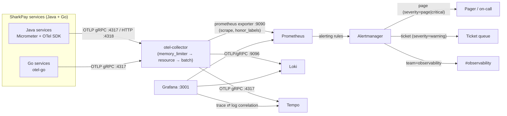

# SharkPay Observability — Platform Bible

| | |
|---|---|
| **Status** | Active — owned by the observability platform (Task 13) |
| **Companion to** | [ADR 001 — stack lock](adr/001-stack-lock.md) · [SECURITY](SECURITY.md) · [RUNBOOKS](RUNBOOKS.md) (alert runbooks) · [infrastructure/observability/README](../infrastructure/observability/README.md) |

Observability at SharkPay is **code, not opinion**: every pipeline component,
recording rule, alert and dashboard lives in
`infrastructure/observability/` and boots with one compose overlay. This
document is the contract between the platform and every service team: metric
names, label conventions, SLOs, alert routing and dashboard semantics are all
defined here and nowhere else.

---

## 1. Stack (locked by ADR 001)

| Signal | Collection | Storage / UI | Alerting |
|---|---|---|---|
| Metrics | OTel Collector (OTLP) | Prometheus (via collector's `:9090` exporter) | Prometheus rules → Alertmanager |
| Logs | OTel Collector (OTLP) | Loki (OTLP/gRPC `:9096`) | — (metrics alert on log-derived counters where useful) |
| Traces | OTel Collector (OTLP) | Tempo (OTLP gRPC `:4317`) | — |
| Dashboards | — | Grafana (provisioned: 3 datasources + 6 dashboards) | — |

## 2. Architecture



ASCII fallback:

```
 services (OTLP 4317/4318) ──▶ otel-collector ──▶ prometheus-exporter :9090 ──scrape──▶ Prometheus ──▶ Alertmanager ──▶ page / ticket / #observability
                                     │                                                (rules: RED + SLO burn + money-path)
                                     ├──▶ loki :9096 (logs, OTLP/gRPC)
                                     └──▶ tempo :4317 (traces)                 Grafana :3001 ──▶ prometheus | loki ⇄ tempo
```

Key design decisions:

1. **Push, don't scrape.** Services never expose scrape endpoints; they push
   OTLP to the collector. One place to authenticate, buffer, batch and
   attribute — and Java services keep `management.endpoints` minimal
   (`health,info`) as they do today.
2. **The collector is the edge.** It stamps `deployment.environment`, applies
   backpressure (`memory_limiter`), and fans out to all three backends.
3. **Resource attributes become metric labels.** `service.name` →
   `service_name` label on every series (plus collector-derived `job` /
   `instance`). All rules and dashboards group on `service_name`.
4. **Alertmanager is part of the stack** (ADR 001 note 7): dashboards without
   paging are not monitoring.

## 3. Boot & ports

```bash
docker compose -f docker-compose.yml \
                -f infrastructure/observability/compose.observability.yml up -d
```

| Host port | Component | Notes |
|---|---|---|
| 4317 / 4318 | otel-collector OTLP gRPC / HTTP | the root compose sets `OTEL_EXPORTER_OTLP_ENDPOINT=http://otel-collector:4318` on every service; gRPC on 4317 is also open |
| 9091 | Prometheus UI | rules + targets under Status |
| 9093 | Alertmanager UI | receiver URLs are dev placeholders (§9) |
| 3001 | Grafana | admin / `sharkpay-dev`, anonymous Viewer |
| 3100 | Loki HTTP API | `GET /ready` |
| 3200 | Tempo query API | used by Grafana's Tempo datasource |

## 4. Conventions

### 4.1 `service.name` registry (the grouping key)

Every deployment MUST set the OTel resource attribute `service.name` to
exactly these values (they become the `service_name` label):

| service.name | Runtime | Port | Status |
|---|---|---|---|
| `sharkpay-identity` | Java (Spring Boot 4) | 8081 | Wave 2 |
| `sharkpay-wallet` | Java | 8082 | Wave 2 |
| `sharkpay-fx` | Java | 8083 | Wave 2 |
| `sharkpay-risk` | Java | 8084 | Wave 2 |
| `sharkpay-ledger` | Go | 8090 | Wave 1 |
| `sharkpay-providers` | Go | 8091 | Wave 1 |
| `sharkpay-payments` | Java + Temporal | — | Phase 5 |
| `sharkpay-payouts` | Java + Temporal | — | Phase 6 |
| `sharkpay-api-gateway` | Java | — | Phase 9 (webhooks) |
| `sharkpay-reconciliation` | — | — | Phase 10 |

Java services get this for free — `spring.application.name` is already
`sharkpay-*` in every `application.yml`. Go services must set
`OTEL_SERVICE_NAME=<registry value>`. (Container ports are listed above;
in the dev compose the Java services are published to host 8082–8085
because wiremock owns host 8081 — see docker-compose.yml.)

Other resource attributes (set by the platform where possible):
`service.namespace=sharkpay`, `service.instance.id` (pod/container),
`deployment.environment` (stamped by the collector's `resource` processor
from `DEPLOYMENT_ENVIRONMENT`, default `local`).

### 4.2 Metric naming (Micrometer → Prometheus)

Java services use **Micrometer**; the Prometheus mapping is mechanical and
MUST be followed when choosing meter names:

| Micrometer (code) | Prometheus (scraped) | Rule |
|---|---|---|
| `Counter("sharkpay.ledger.postings", "result")` | `sharkpay_ledger_postings_total{result}` | dots → underscores, counters gain `_total` |
| `Timer("sharkpay.ledger.posting.duration")` | `sharkpay_ledger_posting_duration_seconds_{count,sum,bucket}` | timers gain `_seconds` + histogram parts |
| `TimeGauge("sharkpay.wallet.projection.lag", ...)` | `sharkpay_wallet_projection_lag_seconds` | base unit suffix |
| `Gauge("sharkpay.providers.breaker.state", ...)` | `sharkpay_providers_breaker_state` | no unit → no suffix |

Go services publish OTLP metrics with dots (`sharkpay.ledger.postings`); the
collector's Prometheus exporter applies the same normalization, so both
runtimes land on **identical** Prometheus names.

**Canonical business metrics** (alerts/dashboards depend on these — adding a
service means emitting the rows marked for it):

| Metric | Type | Labels | Emitters |
|---|---|---|---|
| `sharkpay_ledger_postings_total` | counter | `result=success\|error`, `error_code` | ledger |
| `sharkpay_ledger_posting_duration_seconds` | timer | — | ledger |
| `sharkpay_ledger_lock_wait_seconds` | timer | `account_type` | ledger |
| `sharkpay_ledger_lock_contentions_total` | counter | — | ledger |
| `sharkpay_wallet_projection_lag_seconds` | gauge | `topic` | wallet |
| `sharkpay_wallet_balance_ops_total` | counter | `op=available\|total` | wallet |
| `sharkpay_wallet_balance_op_duration_seconds` | timer | `op` | wallet |
| `sharkpay_wallet_ledger_events_applied_total` | counter | `result=success\|duplicate\|out_of_order\|error` | wallet |
| `sharkpay_wallet_holds_total` | counter | `action=placed\|released\|captured` | wallet |
| `sharkpay_wallet_idempotency_conflicts_total` | counter | — | wallet |
| `sharkpay_providers_breaker_state` | gauge | `provider`, `state=closed\|open` | providers |
| `sharkpay_providers_callbacks_total` | counter | `provider`, `result=success\|signature_failure\|replay\|stale\|error` | providers |
| `sharkpay_providers_callback_duration_seconds` | timer | `provider` | providers |
| `sharkpay_providers_transfers_total` | counter | `provider`, `result` | providers |
| `sharkpay_payments_intents_total` | counter | `state` (funnel states) | payments |
| `sharkpay_payments_payment_duration_seconds` | timer | — | payments |
| `sharkpay_payments_workflow_total` | counter | `result=success\|failure\|timeout` | payments |
| `sharkpay_payments_failures_total` | counter | `reason` | payments |
| `sharkpay_webhooks_deliveries_total` | counter | `result=success\|failed` | api-gateway |
| `sharkpay_<service>_consumer_lag` | gauge | `consumer`, `topic` | every NATS consumer |

Label conventions: `result` for outcomes (lowercase snake), `state` mirrors
the state machines (docs/STATE-MACHINES.md), `provider` = adapter id,
`error_code` = the API error envelope code, `currency` = ISO-4217. Money in
metrics is **never** an amount — only counts and latencies (amounts are for
traces/logs, minor-unit integers).

### 4.3 HTTP (RED) metrics — dual-name harmonization

Java (Micrometer) and Go (otel-go semconv) emit different names for the same
thing:

| Runtime | Request metric | Status label |
|---|---|---|
| Java | `http_server_requests_seconds_{count,sum,bucket}` | `status` |
| Go | `http_server_request_duration_seconds_{count,sum,bucket}` | `http_response_status_code` |

Every RED recording rule in
`prometheus/rules/recording-rules.yml` unions both families with `or`, so
downstream rules/alerts/dashboards see ONE canonical set:

| Recording (canonical) | Meaning |
|---|---|
| `sharkpay_service:http_requests:rate{5m,30m,1h,6h}` | request rate per service |
| `sharkpay_service:http_errors:rate{...}` | 5xx rate per service (zero-fallback) |
| `sharkpay_service:http_error_ratio:rate{...}` | E/R |
| `sharkpay_service:http_request_duration_seconds:p99_5m` (+p95, p50, avg) | latency |
| `sharkpay_service:slo_availability:ratio1h` | `1 − E/R` |
| `sharkpay:consumer_lag:max` | max consumer lag by service/consumer (unions all `sharkpay_*_consumer_lag`) |

Rule names use colons (`<scope>:<series>:<window>`) — the Prometheus
convention that distinguishes rule-produced series from raw metrics.

## 5. Required instrumentation per service

### 5.1 Java (identity, wallet, fx, risk, payments, payouts, api-gateway)

- **Metrics:** Micrometer core + `micrometer-registry-otlp` (push to
  `http://otel-collector:4317/v1/metrics` or gRPC). Standard Micrometer
  binders give `jvm_*`, `hikaricp_*`, `process_*`, `http_server_requests_*`
  — the JVM dashboard and `JvmMemoryPressure` alerts run on these.
- **Traces:** OTel Java SDK (`opentelemetry-sdk` + autoconfigure) with W3C
  trace-context propagation. Export OTLP to the collector.
- **Logs:** Logback JSON encoder (structured), MDC keys populated by the
  OTel appender: `trace_id`, `span_id`, `trace_flags` (§6).
- **Env:** `OTEL_EXPORTER_OTLP_ENDPOINT=http://otel-collector:4318` (set by
  the dev compose) **paired with** `OTEL_EXPORTER_OTLP_PROTOCOL=http/protobuf`
  for the HTTP port — or point at `http://otel-collector:4317` with the
  default `grpc` protocol. Either path reaches the same collector. Set
  `OTEL_SERVICE_NAME=<registry value>` (or rely on
  `spring.application.name`), `OTEL_TRACES_SAMPLER=parentbased_traceidratio`
  with a head-sample ratio of `0.1` in prod, `1.0` in dev.
- **Resilience4j** metrics (`resilience4j_circuitbreaker_state`) are welcome
  additions but are NOT the breaker source of truth — the Go gateway's
  `sharkpay_providers_breaker_state` is (§4.2).

### 5.2 Go (ledger, providers, and later reconciliation glue)

- **Metrics:** OTLP metric SDK; emit the canonical names from §4.2 plus the
  semconv HTTP metrics (`http.server.request.duration`), which the
  collector normalizes to `http_server_request_duration_seconds_*`.
- **Traces:** otel-go with `otelhttp` middleware (injects/extracts
  `traceparent` and records server spans).
- **Logs:** slog JSON handler with `trace_id`, `span_id`, `trace_flags`
  fields read from the active span context.
- **Env:** `OTEL_EXPORTER_OTLP_ENDPOINT=http://otel-collector:4318` with
  `OTEL_EXPORTER_OTLP_PROTOCOL=http/protobuf` (the value the dev compose
  injects), or `http://otel-collector:4317` with `grpc` —
  `OTEL_SERVICE_NAME=sharkpay-ledger|sharkpay-providers`.

### 5.3 NATS consumers (all runtimes)

Every JetStream consumer maintains, per `consumer` name, the gauge
`sharkpay.<service>.consumer.lag` (messages the consumer is behind the
stream, from `ConsumerInfo.NumPending + NumAckPending`), refreshed at least
every 5s. This feeds `sharkpay:consumer_lag:max`,
`NATSConsumerLagHigh` and the wallet-lag alert context. Consumers with a
time-based lag view should also expose
`sharkpay.<service>.consumer.lag.seconds`.

## 6. Trace propagation & log correlation

- **Wire format: W3C Trace Context** — `traceparent: 00-<32 hex trace id>-<16
  hex span id>-<flags>`. Every client→gateway→service HTTP hop and every
  service→service hop carries it. `tracestate` is optional.
- **Across NATS:** the CloudEvents envelope gains a `traceparent` extension
  attribute (producer serializes its current context; consumers extract and
  continue the trace). This keeps the payments→providers→ledger chain in one
  trace even though it hops through the broker.
- **JSON logs (both runtimes) — canonical fields:**

```json
{
  "ts": "2026-09-01T12:34:56.789Z",
  "level": "INFO",
  "service": "sharkpay-wallet",
  "logger": "c.s.w.service.PlaceHoldUseCase",
  "msg": "hold placed",
  "wallet_id": "wlt_01J...",
  "amount_minor": 150000,
  "currency": "KES",
  "trace_id": "4bf92f3577b34da6a3ce929d0e0e4736",
  "span_id": "00f067aa0ba902b7",
  "trace_flags": "01"
}
```

`trace_id` / `span_id` / `trace_flags` MUST be lowercase hex, exactly the W3C
format — Loki's `derivedFields` (datasource provisioning) extracts
`trace_id` and links straight into Tempo; Tempo's `tracesToLogsV2` jumps
back by `service_name`. No PII beyond identifiers; amounts are minor-unit
integers (docs/SECURITY.md §1 log-redaction rule).

## 7. Dashboards (Grafana folder "SharkPay")

| Dashboard (uid) | Answers | Key panels |
|---|---|---|
| **Platform Overview** (`sharkpay-platform-overview`) | "Are we meeting our SLOs, and what is burning?" | SLO stat tiles (availability 99.9%, API p99 < 500ms, burn rate, projection lag, breakers open, webhook success), RED per service, consumer lag, firing-alert list |
| **Ledger Posting** (`sharkpay-ledger-posting`) | "Is the money path healthy?" | posting throughput/result, p50/p95/p99 vs 200ms SLO, errors by `error_code`, account-lock wait p99 + contentions |
| **Wallet Projections** (`sharkpay-wallet-projections`) | "Are balances current and consistent?" | projection lag by topic vs 5s SLO, available/total balance ops, apply-event results (duplicate/out-of-order), idempotency conflicts, holds by action |
| **Payments Lifecycle** (`sharkpay-payments-lifecycle`) | "Are payments completing?" | intent state funnel, Temporal workflow results, end-to-end latency p95/p99, expiry/failed counts, failures by reason |
| **Providers Gateway** (`sharkpay-providers-gateway`) | "Are the rails and their security controls working?" | breaker state per provider, callback p99, callbacks by result (incl. `signature_failure`, `replay`), transfers by result |
| **JVM Runtime** (`sharkpay-jvm-runtime`) | "Are the Java services resource-healthy?" | heap used/max, GC pause p99 + rate, thread states, HikariCP active/idle/pending, process CPU |

Templating: every dashboard has a `$service` variable
(`label_values(..., service_name)`); providers-gateway additionally exposes
`$provider`. Thresholds are drawn at SLO values so red = SLO breach, not
taste. Adding a dashboard: see
[infrastructure/observability/README.md](../infrastructure/observability/README.md).

## 8. SLOs & error-budget policy

| SLO | Target | Measured by | Alert |
|---|---|---|---|
| API availability (per service) | **99.9%** (30d rolling) | 1 − 5xx ratio | `SLOAvailabilityFastBurn` / `SlowBurn`, `HighErrorRate5m` |
| API latency | **p99 < 500ms** | `sharkpay_service:http_request_duration_seconds:p99_5m` | `P99LatencyBreach500ms` |
| Ledger posting latency | **p99 < 200ms** | `sharkpay_ledger:posting_duration_seconds:p99_5m` | `LedgerPostingP99SLOBreach` |
| Wallet projection freshness | **lag < 5s** | `sharkpay_wallet_projection_lag_seconds` | `WalletProjectionLag` |
| Webhook delivery | **99.5% success** | `sharkpay:webhook_delivery_failure:ratio10m` | `WebhookDeliveryFailureRate` |

Burn-rate alerting (multi-window, multi-burn) on the availability SLO —
30-day error budget = 0.1% of requests:

| Burn | Windows (long AND short) | Action |
|---|---|---|
| **14.4×** (0.1% × 14.4 = 1.44%) | 1h + 5m, both above | `severity=page` — budget gone in ~50h |
| **3×** (0.3%) | 6h + 30m, both above | `severity=warning` (ticket) — budget gone in ~10d |

**Error-budget policy (binding):**

1. Budget is measured per service over 30 days
   (`1 - sharkpay_service:http_error_ratio:rate30d`).
2. While a service's budget is **exhausted** (or `SLOAvailabilityFastBurn`
   is firing), **feature deploys for that service are frozen**; only
   reliability fixes and rollbacks ship. The deploy freeze is lifted when
   burn recovers below 1× for 24h.
3. Freeze authority: incident commander (S1 ladder in docs/SECURITY.md §7);
   CI enforces by blocking the release job for services with an open
   budget-exhausted alert (Phase 10 hardening item).
4. Budget resets are logged in the PRD decision log, not silently.

## 9. Alert routing

Severity vocabulary (labels on every alert):
`page` (wake a human now) > `critical` (money-path/urgent, pages with
grouping) > `warning` (ticket).

| Alert (group) | severity | Fires when |
|---|---|---|
| `SLOAvailabilityFastBurn` | page | 14.4× burn over 1h **and** 5m |
| `SLOAvailabilitySlowBurn` | warning | 3× burn over 6h **and** 30m |
| `HighErrorRate5m` | critical | 5xx ratio > 5% for 5m |
| `P99LatencyBreach500ms` | critical | API p99 > 500ms for 5m |
| `LedgerPostingP99SLOBreach` | warning | posting p99 > 200ms for 10m |
| `LedgerPostingStalled` | critical | zero successful postings 15m while API traffic flows |
| `WalletProjectionLag` | critical | projection lag > 5s for 5m |
| `ProviderCircuitBreakerOpen` | warning | breaker open ≥ 2m (per provider) |
| `NATSConsumerLagHigh` | warning | consumer lag > 1000 msgs for 10m |
| `WebhookDeliveryFailureRate` | warning | failure ratio > 0.5% for 10m |
| `TemporalWorkflowFailureRate` | warning | workflow failures > 5% for 10m |
| `JvmMemoryPressure` / `JvmMemoryCritical` | warning / critical | heap > 85% (10m) / > 95% (5m) |
| `MetricsAbsent` (×6 services) | critical† | no metrics for 10m — service or pipeline dead |
| `OtelCollectorDown` | page | collector scrape endpoint down 2m (platform blind) |
| `AlertmanagerDown`, `PrometheusConfigStale`, `PrometheusRuleEvaluationFailures` | warning | stack self-monitoring |

† `fx` and `risk` alert at `warning` (they fail closed / degrade, unlike the
money-movement services).

**Routing tree** (alertmanager.yml; full table in
[infrastructure/observability/README.md](../infrastructure/observability/README.md)):

- `team="observability"` → #observability receiver first, `continue: true`
  (infra criticals ALSO page — a blind platform is an S1).
- `severity="page"` → pager, `group_wait: 0s`, repeat 1h.
- `severity="critical"` → pager, `group_wait: 30s`, repeat 2h.
- `severity="warning"` → ticket queue, batched 5m, repeat 12h.
- default → ticket.

Grouping: `alertname, service, service_name`. **Inhibition:** critical
inhibits warning (and page inhibits critical) on the same
`alertname + service` — one incident, one page.

Receiver endpoints in the overlay are dev placeholders
(`http://localhost:9999/...`): Alertmanager starts and routes normally; wire
PagerDuty / JSM / Slack URLs at deploy time (secrets via AWS Secrets
Manager, never in this repo — docs/SECURITY.md §3).

## 10. Runbooks

Every alert's `runbook_url` points to
`docs/RUNBOOKS.md#<lowercase-alertname>` (e.g. `MetricsAbsent` →
`#metricsabsent`). RUNBOOKS.md is the alert→procedure contract: it is being
authored by the ops-docs track; the anchor list expected by this stack is
exactly the alert table in §9. An alert without a runbook anchor is a
release blocker for this platform.

## 11. Retention

| Store | Retention | Config |
|---|---|---|
| Prometheus | 15 days | `--storage.tsdb.retention.time=15d` (compose) |
| Loki | 7 days | `limits_config.retention_period: 168h` + compactor |
| Tempo | 7 days | `compactor.compaction.block_retention: 168h` |

Financial audit records (≥ 7 years, docs/SECURITY.md §5) live in Postgres +
WORM S3 — telemetry retention is debugging-only and must not be treated as
compliance storage.

## 12. Adding to this platform

- New service → add its row to §4.1, emit the canonical metrics §4.2, add a
  `MetricsAbsent` rule, and extend the overview dashboards' `$service`
  variable range (automatic — it's `label_values`).
- New dashboard → drop JSON in `grafana/dashboards/` (see infra README).
- New alert → recording rule first if it needs math, then alert rule with
  `for` / severity / summary / runbook anchor; add the runbook.
- Version bumps (collector/prometheus/loki/tempo/grafana images) are pinned
  in `compose.observability.yml` and change only via a new ADR or an
  integrator commit that re-runs the validation in the infra README.

## 13. Production hardening (dev overlay → prod gaps, tracked)

- Swap Loki/Tempo `local` backends for S3/GCS + replication
  (Loki `replication_factor: 3`, cortex-style memberlist).
- Remote-write Prometheus to a long-term store (Thanos/Mimir) past 15d.
- Real receiver URLs + templates (PagerDuty v2, JSM, Slack) from Secrets
  Manager; time-interval mutes for warning noise.
- Collector as a DaemonSet/agent+gateway pair; OTLP auth (`OTEL_EXPORTER_OTLP_HEADERS`)
  and TLS between hops; K8s 1.36 targets per ADR 001.
- SLO burn CI gate for the error-budget freeze (§8 item 3).
